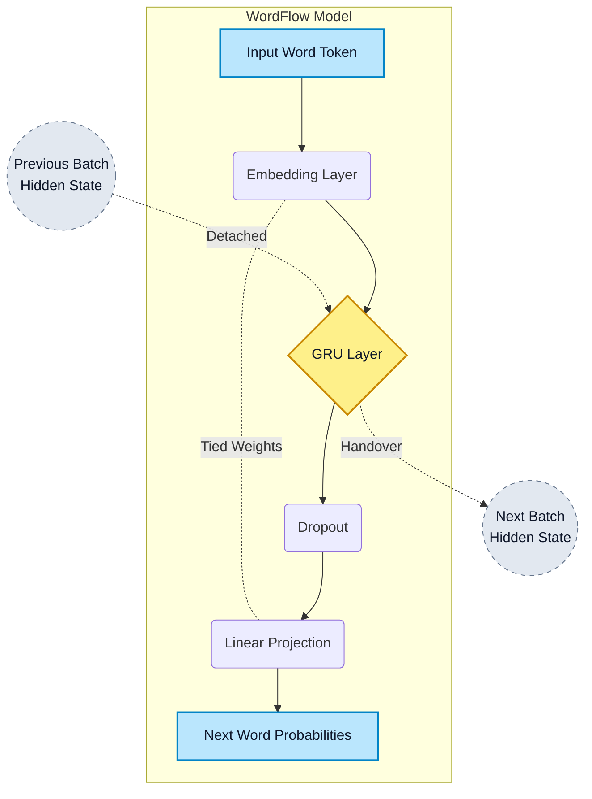

# WordFlow 🌊

[](https://www.python.org/)
[](https://pytorch.org/)
[](https://fastapi.tiangolo.com/)
[](https://opensource.org/licenses/MIT)

**WordFlow** is a custom-built, word-level language model utilizing Recurrent Neural Networks (GRUs) and trained using **Truncated Backpropagation Through Time (BPTT)**. 

---

## 🏆 Latest Checkpoint

The best-performing model checkpoint is hosted on Hugging Face. You can download it via the included script to instantly run the dashboard.

| Run Name | Validation Perplexity | Epochs | Dataset | Hugging Face Repository |
| :--- | :---: | :---: | :---: | :--- |
| `wordflow_run_2026_07_20_06_58` | **11.06** | 80 | [TinyStories](https://huggingface.co/datasets/roneneldan/TinyStories) | [HooM4N/WordFlow](https://huggingface.co/hoom4n/WordFlow) |

---

## ✨ Key Features

1. **Truncated BPTT Architecture:** Custom `Dataset` and `collate_fn` implementations that reshape 1D token sequences into continuous parallel batches, allowing hidden states to gracefully hand over across sequence boundaries.
2. **Interactive FastAPI Dashboard:** A beautifully designed HTML/CSS/JS frontend to visualize training curves (Chart.js), generate stories autoregressively, and explore semantic word similarities.
3. **Optimized Training Pipeline:** Features Mixed Precision (AMP), gradient clipping, Weight Tying (Embedding & Fully Connected layers), and Cosine Annealing Learning Rate scheduling.
4. **Custom Word-Level Tokenizer:** Fast, dependency-free Python tokenizer tailored to build vocabularies and map string text to integer tokens with special token support.
5. **Docker Ready:** Containerized setup for seamless deployment and environment reproducibility.

---

## 🧠 Model Architecture (Truncated BPTT)

The model is built around a lightweight but powerful GRU architecture. By utilizing Truncated BPTT, the hidden state of the RNN is preserved and passed between consecutive batches, allowing the model to learn long-term dependencies beyond the fixed sequence length.



---

## 📊 Dashboard & Inference

The project includes a web interface built with **FastAPI**. It allows you to:
- Load your model checkpoints directly from your file system.
- View real-time training statistics and loss/perplexity charts.
- **Generate Stories:** Autoregressively sample text using temperature and custom seeds.
- **Semantic Search:** Query the trained embedding space for cosine similarities (e.g., finding words similar to "king" or "happy").

### Dashboard Quick Start

**Option 1: Using Docker (Recommended)**
```bash
# 1. Download the latest pre-trained model from Hugging Face
python scripts/download_model.py

# 2. Spin up the dashboard container
docker-compose up --build
```
*Navigate to `http://localhost:8080` in your browser.*

**Option 2: Native Python Environment**
```bash
# 1. Install dependencies
pip install -r requirements.txt

# 2. Download the latest pre-trained model
python scripts/download_model.py

# 3. Run the FastAPI server
uvicorn app.main:app --host 0.0.0.0 --port 8080
```
*Navigate to `http://localhost:8080` in your browser.*

*(To use the dashboard, simply click "Select Run Directory" in the UI and select the `runs/latest` folder generated by the download script!)*

---

## 🚀 Training Setup & Guide

### Objective & Data Processing
The objective of WordFlow is next-word prediction. We utilized the [TinyStories](https://huggingface.co/datasets/roneneldan/TinyStories) dataset. To prepare the data:
1. Stories are lowercased, concatenated, and joined using a custom `<eos>` token.
2. Due to backpropagation constraints on memory and gradients, the continuous corpus stream is split into `batch_size` parallel streams.
3. Each stream is fed in chunks of `seq_len`. The hidden state is detached from the computational graph at the end of each chunk and passed as the initial hidden state to the next chunk.

### Training Quick Start
```bash
# 1. Fetch and process the TinyStories dataset
python scripts/get_data.py

# 2. Run the training pipeline
python scripts/train.py --config_path configs/config.yaml
```

### Training Configuration Summary
Below is a summary of the hyperparameters utilized for our best checkpoint (configurable via `configs/config.yaml`):

| Component | Configuration / Value |
| :--- | :--- |
| **Dataset** | TinyStories (~16,000 story subset) |
| **Tokenizer** | Custom Word-Level (Vocab Size: ~25,000) |
| **Model Architecture** | Embedding Dim: 400 <br> Hidden Dim: 400 <br> GRU Layers: 1 <br> Tied Weights: True |
| **Regularization** | Weight Decay: 0.01 <br> Embedding Dropout: 0.2 <br> RNN Dropout: 0.25 <br> Output Dropout: 0.2 |
| **Optimizer** | AdamW (Initial LR: 1e-3, min: 5e-5) |
| **Scheduler** | Cosine Annealing LR |
| **Training Loop** | Batch Size: 128 <br> Sequence Length: 256 <br> Gradient Clipping: 1.0 (Max Norm) <br> Mixed Precision: Enabled |

---

## 📁 Project Structure

```text
wordflow/
├── app/                  # FastAPI web dashboard and API endpoints
│   ├── static/           # HTML/CSS/JS & Chart.js for frontend
│   ├── main.py           # FastAPI application initialization
│   ├── schemas.py        # Pydantic request/response models
│   └── services.py       # Inference and file parsing logic
├── configs/              # YAML configuration files for model/training
├── notebooks/            # Jupyter notebooks for Exploratory Data Analysis (EDA)
├── scripts/              # Executable scripts (Data fetching, Training, HF download)
└── src/                  # Core PyTorch source code
    ├── data.py           # Text preprocessing
    ├── dataset.py        # Truncated BPTT Dataset logic
    ├── model.py          # WordFlowModel (GRU) definition
    ├── tokenizer.py      # Custom word-level tokenizer
    └── trainer.py        # Training loop and evaluation
```

## License
This project is open-sourced under the MIT License.